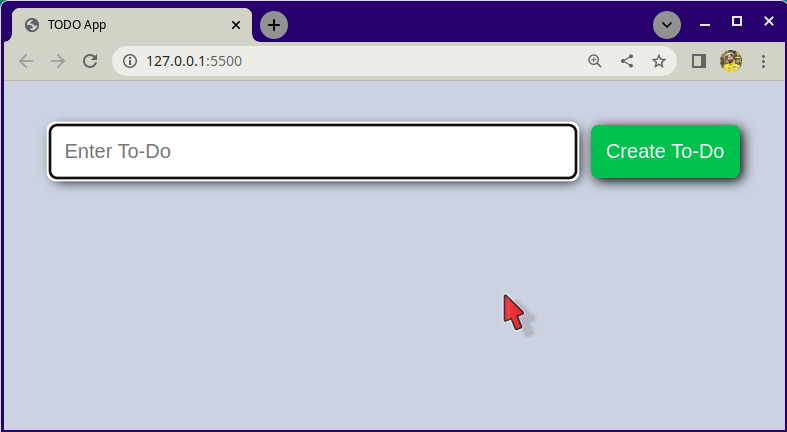

# To-Do-Liste App

### Beschreibung:

- Mit dieser To-Do-Listen-App soll der Nutzer in der Lage sein, Einträge zur To-Do-Liste hinzuzufügen.
- Es gibt ein `input`, in dem die Einträge hinzugefügt werden.
- Der Nutzer kann diese Einträge auch über einen `button` löschen.

1. Erstelle eine To-Do-Listen-App mit einem `input`-Feld und einem `button` mit der Aufschrift **"Create Task"** zum Hinzufügen von To-Dos. Wenn du auf den `button` klickst, soll eine Aufgabe zur Liste der Aufgaben hinzugefügt werden.

2. Füge einen `button` _Delete_ zu jedem Eintrag hinzu, damit der Nutzer eine Aufgabe aus der Liste löschen kann.

3. **Optional:** Style nach deinem Geschmack.

## Bonus

- Füge einen `button` hinzu, um anzuzeigen, dass der Artikel vollständig ist.
- Du kannst ein Styling hinzufügen, um einen Artikel durchzustreichen.

> Tipp: In der folgenden Abbildung siehst du, wie dein Ergebnis aussehen sollte.
> 

